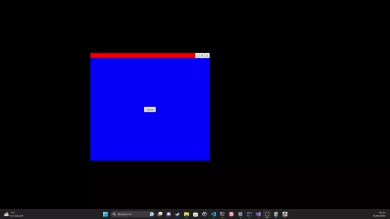

JFxBorderlessNative
================

This library provide true support of Windows 10 Aero Snap On JavaFx Undecorated non transparent Borderless window
Native code is based on example found on this repository https://github.com/melak47/BorderlessWindow

## Inspiration 
https://github.com/goxr3plus/FX-BorderlessScene
https://github.com/CatWithAWand/BorderlessSceneFX

## Demo

## Requirements
Tested with Java 8+ and Windows 7,10 and 11

## Import in your project

    implementation("io.github.pillisan42:jfx-borderless-native:1.0.7")

## Quick sample

    static   //static initializer code
    {
        BorderlessNative.loadJarDll("deploy");
    }

    @Override
    public void start(final Stage primaryStage) {
        [...]
        Scene scene=new Scene(root, 300, 250, Color.RED);
        primaryStage.setScene(scene);
        BorderlessNative borderlessNative=showBorderlessAeroSnap(primaryStage,movePane);
        maximizeButton.setOnAction(event -> borderlessNative.maximizeOrRestore());
    }

    public BorderlessNative showBorderlessAeroSnap(Stage primaryStage,Node... moveNode) {
        primaryStage.initStyle(StageStyle.UNDECORATED);
        primaryStage.show();
        BorderlessNative borderlessNative= new BorderlessNative(primaryStage);
        borderlessNative.setCaptionNode(moveNode);
        borderlessNative.makeWindowsBorderless("Sample");
        return borderlessNative;
    }

To run the sample clone this repository and open it from intellij and run the sample
java io.github.pillisan42.Sample

## Visual Studio Params
Configuration Properties
Configuration Type = DynamicLibrary .dll
Windows SDK Version = 10.0 (may be downgraded to support Windows 10 or below)
Platform Toolset = Visual Studio 2019 (v142)

### For Java 17

C/C++ -> General -> Additional Include Directories C:\PathToJRE\zulu17.40.19-ca-fx-jdk17.0.6-win_x64\include; C:\PathToJRE\JRE\zulu17.40.19-ca-fx-jdk17.0.6-win_x64\include\win32

### For Java 8

C/C++ -> General -> Additional Include Directories C:\PathToJRE\zulu8.70.0.23-ca-fx-jdk8.0.372-win_x64\include; C:\PathToJRE\JRE\zulu8.70.0.23-ca-fx-jdk8.0.372-win_x64\include\win32

## Note

You may need to install vcredist 2019 for making this library work

## TODO Support
- [x] Clean sln solution
- [x] Support JDK8 and JFX8 
- [x] Release on Maven central
- [X] Stabilisation
- [X] Test on Windows 7 and 10

